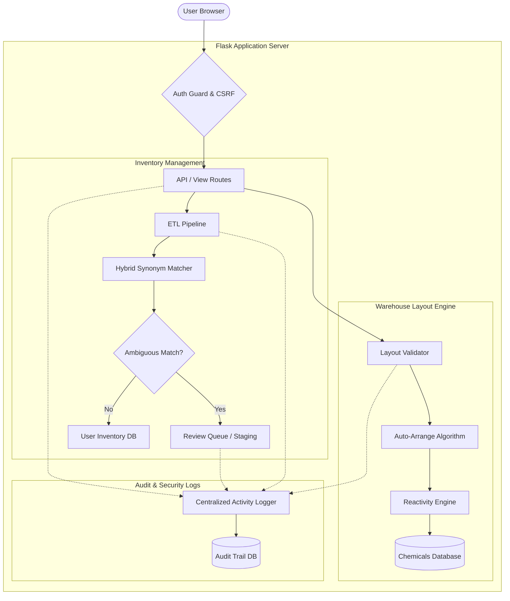

# CAMEO Chemical Safety & Compatibility Platform

This repository contains the CAMEO Chemical Safety & Compatibility Platform, an offline-capable web application designed to manage chemical inventories, analyze compatibility hazards, and optimize warehouse layout placement to prevent dangerous chemical reactions.

---

## Architecture & System Flow

The diagram below illustrates the high-level system architecture and how user requests flow through the security middleware, inventory matching pipeline, and warehouse layout optimization logic.



---

## Core Features

### 1. Centralized Authentication & Tenant Isolation
- **Secure Authentication**: Implements robust user registration, login, and session validation.
- **Tenant Database Isolation**: Each registered organization (tenant) has its own isolated SQLite database containing its inventory and audit logs, preventing cross-tenant data leaks.
- **CSRF Protection**: All state-modifying requests (POST, PUT, DELETE) are protected by a global CSRF verification middleware using secure cookies.

### 2. ETL & Hybrid Synonym Matcher
- **Bulk Imports**: Supports Excel and CSV file uploads for chemical inventories.
- **Synonym Matcher**: Employs a hybrid string-matching algorithm that checks chemical names, CAS numbers, and synonyms against the offline database.
- **Safe List Safeguards**: Removes dangerous generic synonyms (such as "salt", "alcohol", and "peroxide") from auto-matching lists to prevent hazardous false positives.
- **Staging and Review Queue**: Ambiguous chemicals are placed in a staging queue for manual review, ensuring only verified items make it into active storage.

### 3. Chemical Reactivity Engine
- **Offline Reactivity Engine**: Analyzes chemical mixtures and detects incompatibility hazards based on reactivity classification groups.
- **Pairwise Compatibility Analysis**: Generates a matrix displaying compatibility status (Compatible, Caution, Incompatible, No Data) between multiple chemicals.
- **Self-Hazard Escalation**: Evaluates individual chemicals for hazards (e.g., highly flammable, toxic, water-reactive) and escalates warning flags dynamically.

### 4. Warehouse Layout & Auto-Arrange Optimization
- **Layout Validation**: Validates placements within warehouse sections. Generates warnings for "Caution" situations and blocks "Incompatible" arrangements unless overridden by an administrator.
- **Conflict Graph Modeling**: Represents incompatibility relationships as edges in a graph.
- **Auto-Arrange Algorithm**: Solves a greedy graph-coloring problem to automatically group compatible chemicals into the minimum number of isolated sections, separating incompatible items.
- **Water Reactivity Protection**: Automatically isolates water-reactive chemicals from chemicals classified under the "Water" reactivity group.

### 5. Centralized Activity Logging
- **Detailed Audit Trail**: Logs critical system events (e.g., imports, matching decisions, manual overrides, validation failures).
- **Post-Transaction Safeguards**: Logger runs safely outside transaction scopes to prevent database deadlocks.

---

## Directory Structure

```text
CAMEO/
├── backend/                  # Flask Backend Application
│   ├── auth/                 # Authentication Models & Security Middleware
│   ├── data/                 # SQLite Databases (Chemicals, Users, Audit Logs)
│   ├── etl/                  # ETL Pipeline & Synonym Matching Logic
│   ├── logic/                # Reactivity Engine & Compatibility Rules
│   ├── routes/               # API Blueprints & Page Views
│   ├── static/               # Static Web Assets (CSS, Fonts, Local JS Libraries)
│   ├── templates/            # Jinja2 HTML Page Templates
│   └── app.py                # Main Application Entry Point
├── docs/                     # Sprint Documentation & QA Guides
└── tests/                    # Pytest Suite (Integration & Regression Tests)
```

---

## Getting Started

### Prerequisites
- Python 3.8 or higher
- SQLite3

### Setup & Installation
1. Clone the repository and navigate to the project directory:
   ```bash
   cd C:\Users\aminh\OneDrive\Desktop\CAMEO\CAMEO
   ```

2. Install the required Python packages:
   ```bash
   pip install -r backend/requirements.txt
   ```

3. Ensure the offline databases are set up in the `backend/data/` folder. The application will auto-initialize empty auth databases on first startup.

### Running the Application
To start the Flask development server:
```bash
python backend/app.py
```
By default, the server will run on `http://127.0.0.1:5000`. Open this address in your browser to access the SafeWare platform interface.

---

## Testing & Quality Assurance

The codebase is fully tested using the `pytest` framework.

To execute the test suite, run the following command from the
`CAMEO/backend` directory (the live suite lives under `backend/tests/`;
running from `CAMEO/` walks an unrelated `tests/` tree of older
scripts and Playwright E2E):

```bash
cd CAMEO/backend
python -m pytest tests/ -v
```

You can also target a single file or test:

```bash
python -m pytest tests/test_warehouse.py -v
python -m pytest tests/test_warehouse.py::TestWarehouse -k auto_arrange -v
```

### Key Test Scenarios Covered
- **Tenant DB Schemas**: Verifies correct initialization of tables in dynamic databases.
- **Confirm Match Integrity**: Ensures staging queue state updates cleanly on match confirmations.
- **Synonym Guard**: Guarantees generic synonyms do not auto-match incorrectly.
- **Container Conversions**: Validates exact conversion of container units (e.g., drums, cylinders) to weight values.
- **Layout Integrity**: Verifies layout isolation controls, auto-arrange section groupings, and admin override validation logic.

---
*Last Updated: June 15, 2026*
